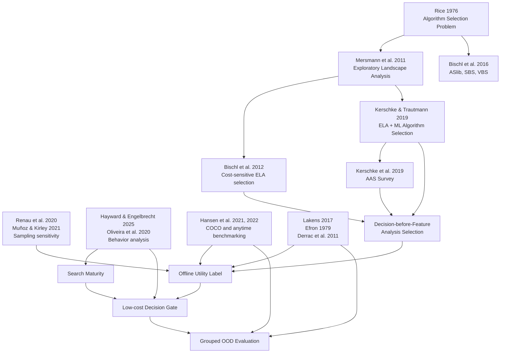

# Decision-before-Feature 科学结论、数学公式与引用关系

## 0. 文档用途

本文档整理当前对话所形成的 Decision-before-Feature 系列研究文档中的主要科学结论、数学公式及其参考文献关系，重点区分：

1. 哪些内容已有文献直接支持；
2. 哪些内容只有方法学或思想来源；
3. 哪些公式是本项目提出的操作性定义；
4. 哪些内容仍是必须通过实验检验的研究假设；
5. 每篇参考文献适合放在论文的什么位置。

引用不是给每句话挂一串作者姓名。真正要避免的是两种情况：把项目自己的创新伪装成前人结论，以及拿一篇“沾边”的论文替尚未完成的实验作证。

---

## 1. 证据等级

| 标记                          | 含义                                           | 推荐写法                     |
| ----------------------------- | ---------------------------------------------- | ---------------------------- |
| **D：直接支持**         | 文献明确提出、定义或验证了该概念               | “已有研究表明……”         |
| **M：方法学支持**       | 文献支持统计方法、实验原则、工具或评价协议     | “依据……本文采用……”     |
| **I：思想来源**         | 文献提供研究灵感，但本项目进行了重新定义或扩展 | “受……启发，本文提出……” |
| **O：项目原创或待验证** | 当前没有文献直接提出同一公式或结论             | “本文定义/提出/假设……”   |

以下内容应明确标为 **O**，不能写成已有文献已经证明：

- Analysis Selection Problem；
- Decision-before-Feature 框架；
- $U_q^{joint}$、$U_b$、$I_q$ 与 query-feature predictive increment 的具体定义；
- 共享前缀配对续跑离线效用标签；
- Search Maturity 三项确定性基函数；
- $M_t=ES_t(1-XS_t)$、$M_t^{linear}$ 与 $R_t^{EE}$；
- 主 `descriptor_cheap_invariant` query 在目标状态分布中的 Utility 方向与比例；
- “Decision Model 开销可以忽略”；
- “Behavior-only 可以预测 Query Utility”；
- “BBOB 上训练的模型可以泛化到 CEC”。

---

## 2. 总体引用关系



左侧文献提供背景、方法和实验规范；右侧的 Analysis Selection、Query Utility、Search Maturity 和 Decision Gate 是本项目要建立的新层次。

---

# 3. 科学结论与引用关系矩阵

## 3.1 Algorithm Selection、ELA 与研究定位

| 编号 | 当前方案中的结论                                              | 证据等级 | 推荐引用               | 引用关系与限制                                                                 |
| ---- | ------------------------------------------------------------- | -------: | ---------------------- | ------------------------------------------------------------------------------ |
| C1   | 不同问题实例可能适合不同算法，因此需要按实例选择算法          |        D | [R1], [R4], [R5], [R5a] | Rice 给出经典 Algorithm Selection Problem；ASlib、ELA-based AAS 和 AAS 综述给出标准场景 |
| C2   | ELA 通过数值特征描述连续黑盒问题，并可支持算法选择            |        D | [R2], [R5], [R6], [R7] | 可直接用于定义 ELA 及其用途                                                    |
| C3   | 典型 ELA-based AAS 流程为“特征提取 → 选择器 → 优化算法”   |        D | [R3], [R5], [R5a]      | 支持基本流程，但不代表所有方法都必须如此                                       |
| C4   | 特征获取成本和算法运行成本可以纳入成本敏感选择                |    D / I | [R3]                   | Bischl 等支持成本敏感选择；本项目进一步决定“是否获取特征”                    |
| C5   | 应先判断所评估固定 query 是否值得执行，再决定是否进入 feature-based selection |        O | [R1]–[R5] 仅作背景    | 这是本文提出的 Analysis Selection Problem                                      |
| C6   | 固定 query 的有效成本取决于采样、特征组和实现方式    |    D / M | [R5], [R8], [R9]       | 不能把当前配置成本外推为“ELA 天然昂贵”                                                 |

### 推荐论文表述

> Exploratory landscape analysis provides numerical descriptors of continuous black-box problems and has been combined with machine learning for per-instance algorithm selection [R2, R3, R5]. This setting is part of the broader automated algorithm selection literature [R5a]. Existing pipelines, however, generally presume that landscape information is acquired before selection. We introduce a preceding analysis-selection problem that asks whether its expected downstream benefit justifies its acquisition cost.

最后一句属于本文贡献，不应在句末挂一串文献假装前人已经替你创新完了。

---

## 3.2 Query Utility 与 Offline Utility Label

| 编号 | 当前结论或公式                                            | 证据等级 | 推荐引用           | 引用关系与限制                                                             |
| ---- | --------------------------------------------------------- | -------: | ------------------ | -------------------------------------------------------------------------- |
| C7   | 固定 query 的效用应通过执行与跳过两条路径的结果差异评估            |    O / I | [R3], [R10], [R11] | 成本敏感选择和黑盒基准评估提供基础；两分支定义属于本项目                   |
| C8   | 两条路径应共享相同前缀状态并采用配对随机流                |    M / O | [R29]              | Common Random Numbers 支持配对比较和方差降低；semantic RNG fork 是项目协议 |
| C9   | 所有策略应共享相同总函数评价预算                          |    D / M | [R10], [R11]       | COCO 将函数评价数作为核心黑盒成本                                          |
| C10  | $U_q^{joint}$、$U_b$ 与 $I_q$ 应保存为连续标签，而不只保存二元标签 |        O | [R3] 仅作背景      | 三个量定义不同，不能用一个 `U_query` 字段代替                              |
| C11  | Query 路径应使用现实可部署的 selector；VBS 只能作为理论上界 |    D / M | [R1], [R4], [R5]   | SBS/VBS 是算法选择中的标准比较概念                                         |
| C12  | Query 特征会受采样策略与样本规模影响                        |        D | [R8], [R9]         | 直接支持冻结采样协议和开展敏感性分析                                       |
| C12a | 当前 `selection_reference` 是固定下游组件，不是本文贡献点 |    M / O | [R3], [R5], [R5a]  | 文献支持 ELA-based selector 范式；当前实现质量和泛化风险必须由本文诊断报告 |
| C12b | 在线共享状态任务的 selector 应由同一状态上的候选 continuation loss 监督，并连续接收剩余预算 | O | [R5], [R29] 作背景 | 性能回归与配对运行提供方法背景；逐状态动作集合、`cv_group_id = function_id` cross-fitted predictions 和 best-observed-action 分解属于本项目协议 |
| C12c | 逐状态最小已观测 action loss 不能称为 oracle，也不能在实测 loss 外再次扣除 Population Transfer 影响 | O | 无需外部引用 | 这是术语与代数一致性要求；handoff 已进入 observed action loss，query FE 已进入等总预算路径 |
| C12d | Query sample 虽不进入 optimizer population，但 sample best 与 first hit 必须进入 Query terminal gap、`target_hit_observed` 与 ERT；`endpoint_success` 另要求 continuation 完成 | O / M | [R10], [R11] | objective evaluation 与 endpoint 记账有 benchmarking 背景；具体 sample/continuation 分解是项目协议 |
| C12e | `query_operational_increment_lamT_1` 与 `query_feature_predictive_increment_log10_gap` 回答不同问题 | O | 无需外部引用 | 前者是不同预算 operational paths 的净差；后者是同一 query-budget outcomes 上的 OOF continuation-only 预测诊断 |

---

## 3.3 行为特征与 Search Maturity

| 编号 | 当前结论或公式                                           | 证据等级 | 推荐引用              | 引用关系与限制                                         |
| ---- | -------------------------------------------------------- | -------: | --------------------- | ------------------------------------------------------ |
| C13  | 元启发式搜索行为可以通过一组指标进行量化和比较           |        D | [R12], [R13]          | 支持行为分析的可行性                                   |
| C14  | 输入应尽量采用算法无关行为，而不是算法专属参数           |    I / O | [R12], [R13]          | 文献提供跨算法行为表征动机；严格排除算法参数是本文协议 |
| C15  | 改进率、多样性、停滞和集合分布变化可描述不同搜索状态     |    I / O | [R12], [R14]          | 行为分析提供动机；本文集合统计及其预测价值仍需验证      |
| C16  | Search Maturity 是既有 Behavior 的三项确定性基函数组      |        O | [R12]–[R15] 仅作灵感 | 不是独立观测、latent state、收敛判据或因果中介         |
| C17  | $M_t=ES_t(1-XS_t)$、线性组合与 explore/exploit ratio 是预设重参数化 | O | 无直接支持 | 只能通过六组消融评价其对固定线性候选的预测增量         |
| C18  | Maturity 与 Utility 的曲线方向不在定义中预设             |        O | 无直接支持            | 任何曲线形状均须由冻结结果与不确定性描述               |

---

## 3.4 “不需要主 query”与统计推断

| 编号 | 当前结论或公式                                                 | 证据等级 | 推荐引用     | 引用关系与限制                                 |
| ---- | -------------------------------------------------------------- | -------: | ------------ | ---------------------------------------------- |
| C19  | $p>0.05$ 不能证明两种策略等价                                |        D | [R16]        | 应采用等价性检验或置信区间                     |
| C20  | 各 endpoint 的最小实际效应和等价边界应预先确定                 |    D / M | [R16]        | 当前仅有项目内 operational tolerance：Utility、`log10_gap`、runtime ratio、call/target-hit rate；`endpoint_success` rate 若使用须另定边界 |
| C21  | Bootstrap 可估计 Utility 或比例的不确定性                      |    D / M | [R17]        | 分层重采样单位由数据依赖结构决定               |
| C22  | 多算法、多问题比较应考虑非参数检验和多重比较校正               |    D / M | [R18], [R19] | 具体检验必须匹配配对层级                       |
| C23  | 状态条件 $U_q^{joint}\le0$ 的比例应按目标分布估计而不预设多数方向 | O / M | [R17] | function 顶层、run/problem 等权及区间是当前预设；“多数”只可在区间确实支持时使用 |
| C24  | 同一轨迹上的多个 checkpoint 不能视为独立样本                    |        M | [R17]        | BBOB-validation 条件 bootstrap 固定六个已见 functions、dimensions 与 static problems，只在每个 problem 内配对重抽 seeds，抽中 run 的完整 state sequence 保留为簇 |

---

## 3.5 Decision Model 与资源开销

| 编号 | 当前结论                                            |       证据等级 | 推荐引用                    | 引用关系与限制                                  |
| ---- | --------------------------------------------------- | -------------: | --------------------------- | ----------------------------------------------- |
| C25  | LDA、Logistic Regression、Ridge 是本轮固定 Decision 候选 |          O / M | 无外部文献可替代            | 候选集合与 nested OOF 选择是本文预定义方法，不是经验结果 |
| C26  | 线性系数或判别方向可描述模型关联                     |              D | 无外部文献可替代            | 系数不是因果效应，也不能单独证明特征“必要”或“不需要” |
| C27  | Decision Model 开销相对固定 query 足够小                       |              O | 无外部文献可替代            | 必须实际测量时间、内存和 FE                     |
| C28  | 若行为特征只读取已有轨迹，则决策阶段可做到零额外 FE | O / 条件性结论 | [R10], [R11] 仅支持 FE 记账 | 只有实现确实不调用目标函数时才成立              |
| C29  | Offline 训练成本与 Online 决策成本应分开报告        |          M / O | [R4], [R10]                 | 具体成本边界由本文定义                          |
| C30  | 本轮不继续增加复杂 Decision 模型变体                |              M | 无外部文献可替代            | 属于预定义范围控制；不得表述为复杂模型已被实验否定 |

---

## 3.6 Baseline、Portfolio 与泛化

| 编号 | 当前结论                                                             | 证据等级 | 推荐引用         | 引用关系与限制                                      |
| ---- | -------------------------------------------------------------------- | -------: | ---------------- | --------------------------------------------------- |
| C31  | 应报告 SBS、VBS、现实 selector 和 proposed gate                      |    D / M | [R1], [R4], [R5] | 支持算法选择上下界比较                              |
| C32  | Portfolio 应包含具有互补性的算法                                     |    D / I | [R1], [R5]       | 具体四算法组合仍是本文设计                          |
| C33  | DE、PSO、CMA-ES、SHADE 可作为本项目的四算法连续优化 portfolio          |        D | [R24]–[R27]     | 当前实现是 SHADE，不得写成 L-SHADE；也不能宣称覆盖全部搜索范式 |
| C34  | BBOB/COCO 可用于规范化黑盒优化评估                                   |        D | [R10], [R11]     | 支持实例、FE 和 anytime 评价                        |
| C35  | CEC2017 与 CEC2022 可作为跨 benchmark 测试集                         |    D / O | [R30], [R31]     | 技术报告定义 benchmark；将其视作 OOD 是本文实验设计 |
| C36  | Function-ID grouped split 比随机 instance split 更直接检验未见 function ID，同时阻止同一基础函数泄漏 |    I / O | [R8]–[R10]      | 当前 `cv_group_id = function_id`；`family=bbob_fNNN` 不是经典 landscape-family taxonomy，不能据此声称跨函数族泛化 |
| C37  | 应分别报告跨维度、未见 function ID、跨 benchmark 与留一算法诊断；跨经典函数族只有在补充可复核 taxonomy 后才可命名 |    O / M | [R10], [R11]     | 属于本文分层泛化协议，不把不同层级池化为单一 OOD 结论 |

---

# 4. 数学公式与引用核对

## 4.1 传统 Algorithm Selection

给定问题实例 $p$、实例特征 $\phi(p)$、算法集合 $\mathcal A$ 和选择器 $S$：

$$
a^*=S\bigl(\phi(p)\bigr),\qquad a^*\in\mathcal A.
$$

引用关系：

- Algorithm Selection Problem：[R1]；
- ELA 特征 $\phi(p)$：[R2]；
- ELA 与机器学习选择器：[R3], [R5]；
- AAS 综述背景：[R5a]；
- SBS、VBS 和标准化场景：[R4]。

---

## 4.2 Analysis Selection 决策变量

在搜索状态 $s_t$ 上定义：

$$
d_t\in\{0,1\},
$$

其中：

$$
d_t=
\begin{cases}
1, & \text{执行固定 query},\\
0, & \text{不执行 query}.
\end{cases}
$$

这是本项目的原创问题定义。可以引用 [R1]–[R5] 说明传统研究聚焦“选择哪个算法”，但公式本身应使用：

> We define an analysis-selection variable...

而不能写成“according to Bischl et al.”，因为他们没有定义这个变量。

---

## 4.3 五条路径的 terminal endpoint

对 `skip`、Query/full Selector、matched-acquisition state-only、sampling-only continue-current 与 Behavior-only full-budget 五条路径，预指定 Stage-A 单次科学运行固定 gap、`observed_first_hit_FE`、`target_hit_observed`、`path_completed`、`endpoint_success`、planned/effective FE 与失败状态；令其 raw terminal gap 分别为 $g_s,g_q,g_m,g_c,g_b$。同一 query sample 不并入 optimizer population，但其 sample best 和 first hit属于三条 acquisition 路径的 Stage-A endpoint：

$$
g_q=\min\{g_{\mathrm{query\ sample}},g_{\mathrm{selected\ continuation}}\}.
$$

同时保存 continuation-only gap、`query_first_hit_offset` 与 sample-best contribution。对任一路径：

$$
\ell_k=\log_{10}\!\left(\min\{\max(g_k,10^{-12}),10^{20}\}\right).
$$

引用关系：objective-evaluation、target 与 anytime endpoint 可引用 [R10], [R11]；sample/continuation 的具体合并与分解是本文协议。

---

## 4.4 Joint Utility、Behavior-only Utility 与query 操作性增量

Stage-B 将每条 selected 路径从同一 decision state/RNG 到 terminal 真实执行预定三次，但只形成 timing。每次保存 raw observed wall-clock；completed repetition 的 censored time 等于 raw，timed-out/failed repetition 为 `max(raw, role timeout)`，$T_k$ 固定为三次 censored time 的中位数。raw median 仅作诊断，旧 failure-worst-case 字段只作同一 censored 值的兼容别名。逐次保存 `observed_first_hit_FE`、`target_hit_observed`、`target_hit_before_failure`、`path_completed`、`endpoint_success`、effective FE 与失败字段；路径身份、completed replays 内部 endpoint、Stage-A→completed replay endpoint 一致性分列，Stage-B status instability 与跨阶段 completion instability 也分列。任何 replay 都不得覆盖 Stage-A 科学端点或选择性补跑。共享 prefix 视为 sunk cost。FE=0→terminal policy wall-clock 另报，不进入 Utility，并遵循相同科学/计时分离。主 $\lambda_M=0$：

$$
U_q^{joint}=(\ell_s-\ell_q)-\lambda_T(\log_{10}T_q-\log_{10}T_s),
$$

$$
U_b=(\ell_s-\ell_b)-\lambda_T(\log_{10}T_b-\log_{10}T_s),
$$

$$
I_q=(\ell_b-\ell_q)-\lambda_T(\log_{10}T_q-\log_{10}T_b)
=U_q^{joint}-U_b.
$$

$U_q^{joint}$ 是执行固定 query、full Selector、必要 handoff 与 continuation 相对 Skip 的联合路径净差；$I_q$ 比较 Query 与 Behavior-only full-budget 两条 operational paths，包含不同 FE budget、sample best 和 acquisition time，不能称为纯信息效应。

query descriptors 的边际预测贡献另用 `query_adjusted_state_only_selector` 与 full Query Selector 在同一 query-budget action outcomes 上的 OOF selected continuation-only `log10_gap` 差；不新增 action losses、不计 sample best、不扣 acquisition cost。

引用关系：成本敏感选择思想 [R3]，ELA-based AAS [R5]，FE/anytime 评价 [R10], [R11]；全部具体公式属于本文定义。若 query FE 已从 continuation budget 扣除，不能再次扣同一 FE。

---

## 4.5 First-trigger threshold

对每个 run：

$$
t_r^*=\min\{t:z_\theta(s_{r,t})>\tau_{\mathrm{OOF}}\}.
$$

$\tau_{\mathrm{OOF}}$ 只从 BBOB-train 的 fold-specific 上游 OOF score 与 first-trigger Utility 冻结；BBOB-validation 与外部 suite 不参与。Utility 相同时先取调用 run 更少的 threshold，再取数值更大的 threshold。该部署 threshold 与等价性 operational tolerance 是不同对象，不能共用 $\delta$ 混写。

---

## 4.6 重复计时、层级 Bootstrap 与 sign flip

三次重复用于取得每条 decision-state future path 的 censored runtime 中位数，不把三次当独立科学 runs。BBOB-validation 的条件不确定性使用 10,000 次配对层级 bootstrap：固定六个已见 functions、dimensions 与 instances 1/2/3 对应的 static problems，只在每个固定 problem 内配对重抽 optimizer runs；RQ1 对抽中 run 保留完整有序 state sequence。重抽 function 只作函数组成敏感性。

配对 sign-flip 以六个固定且已见的 validation function effects 为单位，并额外假设 signs 可交换。穷举 64 个符号向量时双侧 raw p 最小为 0.03125；RQ3 与 RQ5 各自六 contrast Holm family 的最小 adjusted p 均为 0.1875，因而在 0.05 下数学上不能拒绝。RQ4 按 suite 与 endpoint 分开，不把四个 suites 组成同一 Holm family。逐函数/问题效应、有限集均值和条件 CI 为主，p 值仅作假设敏感辅助；不得称为函数总体或独立确认性推断。

ERT 的层级区间必须在每个 bootstrap replicate 内逐 `function × dimension` 重算 FE numerator、target-hit count 与 treatment/reference log-ratio，再对 dimensions/functions 等权。单方零命中保留为 $\pm\infty$，双方零命中及聚合时同时含两种无穷记为 undefined；任何这类 stratum 或 replicate 都不得删除。undefined mass 保守分配到两侧尾部，`interval_established` 由观测 contrast 与扩展实数分位点是否有定义决定；无界区间仍可建立。

Bootstrap 与 Monte Carlo 方法可引用 [R17]；当前层级、次数和修正属于本文协议。

---

## 4.7 Endpoint 等价

以下数值只定义项目内预设 operational tolerance：

- mean Utility 差：$[-0.01,0.01]$；
- mean `log10_gap` 差：$[-0.05,0.05]$；
- geometric-mean runtime ratio：$[0.95,1.05]$；
- call rate 或 target-hit rate 差：$[-0.05,0.05]$；`endpoint_success` rate 不复用该名称，若分析须另行预设边界。

Utility $\pm0.01$ 在主 log-ratio scalarization 下约对应 $\pm2.3\%$ 复合 ratio，不是领域普适阈值。主条件 CI 为 95%，只描述相对项目内 tolerance 的位置；同一预设 family 的描述性 Bonferroni 区间在 $m$ 个 contrasts 时每项双侧 level 为 $1-0.05/m$，提供 family-wise 95% coverage，但不构成等价检验。若未来未查看评价集要作正式等价判断，须在 outcome 前另行冻结有领域含义的边界、显著性水平与 TOST/同时区间程序。Utility 中 gap/runtime 的抵消不能替代各 endpoint 自身的判断；差异不显著也不等于等价。[R16] 只支持等价性原则，不为当前数值提供领域依据。

---

## 4.8 主 query 状态分布

活动 RQ1 估计：

$$
\pi_{\le0}=P\!\left(U_{q,\mathrm{descriptor\_cheap\_invariant}}^{joint}\le0\right),
$$

目标分布限于 SBS prefix 与 `phase1_dynamic_budget_event_v1` 合格状态。聚合按 state → run → static problem → fixed dimension stratum → function，function 为顶层单位；同时报告逐 function 结果。不得预设 $\pi_{\le0}>0.5$，只有区间实际支持时才可使用“多数”。

---

## 4.9 搜索状态

$$
s_t=
\left[
B_t,\,
P_t
\right],
$$

其中：

- $B_t$：算法无关行为特征；
- $P_t$：预算进度和历史上下文。

行为表征的思想来源：[R12], [R13]；具体状态向量属于本文设计。

---

## 4.10 FE 进度

$$
r_t=
\frac{FE_t}{FE_{\max}}.
$$

COCO/BBOB 将函数评价次数视作核心运行成本和评价尺度：[R10], [R11]。将其归一化为 $r_t$ 是本文为跨预算建模采用的无量纲表示。

---

## 4.11 改进率

对最小化问题，可定义窗口 $k$ 内改进率：

$$
IR_t=
\frac{
f_{\mathrm{best}}(t-k)-f_{\mathrm{best}}(t)
}{k}.
$$

本项目的活动实现使用 shift-invariant 稳健形式：

$$
IR_t^{\mathrm{IQR}}
=
\frac{
f_{\mathrm{best}}(t-k)-f_{\mathrm{best}}(t)
}{
\operatorname{IQR}(f_{\mathrm{init}})+\varepsilon
}.
$$

其中 $f_{\mathrm{init}}$ 是优化器初始化后、任何原生 update 前的已评估 population fitness。改进历史作为行为指标的思想可引用 [R12]；窗口与 IQR 归一化形式是本文实现选择。

---

## 4.12 种群多样性

先按变量边界归一化：

$$
\widetilde x_{i,j}
=
\frac{x_{i,j}-l_j}{u_j-l_j}.
$$

再定义平均两两距离：

$$
D_t=
\frac{2}{N_t(N_t-1)}
\sum_{1\le i<j\le N_t}
\left\|
\widetilde x_i-\widetilde x_j
\right\|_2.
$$

多样性变化：

$$
\Delta D_t=D_t-D_{t-k}.
$$

多样性及其变化用于行为分析可引用 [R12], [R14]。具体距离与归一化方式是本文定义。

需要检查：

- 维度效应；
- 种群规模效应；
- L-SHADE 人口递减效应；
- 边界范围不一致的影响。

---

## 4.13 集合分布变化

跨checkpoint的population不得默认按行建立个体对应关系。本文使用等权经验Wasserstein-1、centroid shift及其coherence描述空间分布变化，并使用协方差谱集中度描述当前集合形状。

fitness变化通过排序后的经验分位数计算改善比例、平均改善率和一维Wasserstein变化率。上述定义对checkpoint内行排列不变，不表示真实个体运动、亲子关系或因果迁移路径。

行为分析动机可引用[R12]、[R14]；具体集合统计公式和用于Query Utility预测的解释属于本文方法，必须由消融、跨算法分层结果和外部评价验证。

---

## 4.14 停滞程度

一种无量纲定义为：

$$
S_t=
\min\left(
1,\,
\frac{\text{连续无改善 FE 数}}{W}
\right),
$$

其中 $W$ 是预先冻结的窗口。停滞作为行为信息可引用 [R12]；公式属于本文设计。

---

## 4.15 Search Maturity

当前方案只定义三项由既有 Behavior 确定性计算的基函数：

$$
M_t=ES_t(1-XS_t),
$$

$$
M_t^{linear}=\frac{ES_t+(1-XS_t)}{2},
\qquad
R_t^{EE}=\frac{E_t}{X_t+10^{-12}}.
$$

它们对应 `bf_search_maturity`、`bf_search_maturity_linear`、`bf_explore_exploit_ratio`，不增加原始信息。

这是本文提出的预设重参数化，不是启发式潜变量、独立观测、真实搜索阶段、因果中介或 Utility 标签。行为文献 [R12]–[R15] 只能支持输入指标有行为意义，不能直接支持三项公式。

必须验证：

1. `B2+Maturity-B2` 与 `B3-(B2+Motion)` 两个预设 contrast；
2. B3 相对相同 milestone rows 上 T0 的增量；
3. 是否跨算法、维度、function 与 query 配置稳定；
4. 描述性关系的方向和不确定性，而不预设曲线形状。

推荐写法：

> We introduce three deterministic search-maturity basis functions...

不应写成：

> Search maturity is defined in the literature as...

---

## 4.16 Utility 预测模型

$$
\widehat U_{q,i}^{joint}
=
f_\theta(s_i).
$$

活动主训练权重依次使 function、固定 dimension stratum、static problem 和 optimizer run 等权，再把 run 权重均分给其 eligible states，并缩放到平均 row weight 为 1；不得按 Utility 区间宽度、标签稳定性或结果事后重加权。旧 `sample_weight=1` 只作敏感性。现有 estimator wiring 尚未实现该 cluster-balanced 主权重，是 blocker。Ridge 的连续目标可写为：

$$
\min_\theta
\sum_{i=1}^{n}
\ell\left(
f_\theta(s_i),
U_{q,i}^{joint}
\right),
$$

活动候选为 LDA、Logistic Regression 与 Ridge。每个 outer/inner fold 必须重算 fold-specific SBS、Selectors、Utility、Decision preprocessing/model 和 first-trigger threshold。具体目标、nested function OOF decision utility、阈值和最终模型选择属于本文方法。Random Forest、XGBoost、LightGBM 与 SHAP 的 [R20]–[R23] 只保留为历史方案或相关方法背景，不支持当前候选选择。

---

## 4.17 Decision 开销

端到端成本账本建议写为：

$$
C_{\mathrm{DBF}}
=
C_{\mathrm{probe}}
+C_{\mathrm{behavior}}
+C_{\mathrm{model}}
+\mathbb I(d=1)C_{\mathrm{query}}
+C_{\mathrm{selection}}
+C_{\mathrm{optimization}}.
$$

Decision gate 本身：

$$
C_{\mathrm{gate}}
=
C_{\mathrm{behavior}}
+C_{\mathrm{model}}.
$$

开销比例：

$$
\rho_{\mathrm{gate}}
=
\frac{C_{\mathrm{gate}}}{C_{\mathrm{query}}}.
$$

成本意识背景：[R3]；FE 与 wall-time 评价：[R10], [R11]。具体公式是本文记账定义。

$$
\rho_{\mathrm{gate}}\ll1
$$

是需要实验检验的假设，不是因为模型叫“Random Forest”就自动成立。处理器并不接受文学论证。

---

## 4.18 等总 FE 预算

$$
FE_{\mathrm{total}}
=
FE_{\mathrm{prefix}}
+FE_{\mathrm{query}}
+FE_{\mathrm{optimization}}.
$$

不执行 query：

$$
FE_{\mathrm{query}}=0.
$$

执行 query：

$$
FE_{\mathrm{optimization}}
=
FE_{\mathrm{total}}
-FE_{\mathrm{prefix}}
-FE_{\mathrm{query}}.
$$

黑盒函数评价成本的依据：[R10], [R11]；具体预算恒等式是本文协议。

---

## 4.19 三档预定义 Landscape Query 的表示依赖性

当前实验从本次协议冻结起不再根据 BBOB-validation、CEC2017 或后续结果搜索紧凑特征子集或改选 query。BBOB-validation 已被旧流程查看，不能以“实验前未见”描述。三档 query 分别构造完整的 joint、Behavior-only 与 operational-increment 链：

$$
U_{q,\mathrm{descriptor\_cheap\_invariant}}^{joint},\quad
U_{q,\mathrm{pflacco\_standard\_invariant}}^{joint},\quad
U_{q,\mathrm{pflacco\_broad\_invariant}}^{joint}.
$$

引用关系：

- pflacco 工具与特征集合：[R6], [R7]；
- 采样与稳定性：[R8], [R9]；
- 三档配置与解释边界：本文协议。

如果三档结论一致，只能写为“在三个预定义 query 配置上具有稳健性”；如果不一致，则报告 representation dependence。不得把当前 14 维自定义描述符称为 Full ELA，也不得把结果外推到全部 pflacco、NeurELA、Deep-ELA 或任意 landscape representation。

---

# 5. 论文各章节的引用配置

## 5.1 Introduction

建议引用：

- Algorithm Selection：[R1], [R4]；
- ELA：[R2]；
- ELA-based AAS：[R3], [R5], [R5a]；
- 采样敏感性：[R8], [R9]。

不要在引言中提前宣称：

- 大多数主 query 调用无效；
- gate 开销可以忽略；
- Search Maturity 是独立状态或与 Utility 呈预定曲线；
- BBOB 训练必然能泛化到 CEC。

这些应写成研究问题。

---

## 5.2 Related Work

建议分为：

1. Automated Algorithm Selection：[R1], [R4], [R5a]；
2. Exploratory Landscape Analysis for AAS：[R2], [R3], [R5]–[R9]；
3. Behavior-based Metaheuristic Analysis：[R12]–[R15]；
4. Cost-aware and Resource-aware Evaluation：[R3], [R10], [R11]。

---

## 5.3 Problem Formulation

引用背景后使用原创措辞：

> We define...

适用于：

- Analysis Selection Problem；
- $d_t$；
- $U_q^{joint}$、$U_b$、$I_q$；
- query-feature predictive increment；
- first-trigger $\tau_{\mathrm{OOF}}$；
- shared-prefix paired continuation utility label generator。

段首可引用 [R1], [R3], [R5]，FE 记账引用 [R10], [R11]。公式后可以明确写 `defined in this work`。

---

## 5.4 Behavior Representation

- 行为分析动机：[R12], [R13]；
- 多样性变化：[R14]；
- 熵基础：[R15]；
- Search Maturity 标明为本文预设的三项确定性 Behavior 基函数，而非独立 latent state。

---

## 5.5 Statistical Analysis

- Bootstrap：[R17]；
- TOST 与最小实际效应：[R16]；
- 非参数算法比较：[R18]；
- Holm 校正：[R19]；
- Common Random Numbers：[R29]。

---

## 5.6 Experimental Setup

- COCO/BBOB：[R10], [R11]；
- CEC2017：[R30]；
- CEC2022：[R31]；
- DE、PSO、CMA-ES、SHADE：[R24]–[R27]；当前实现不得称为 L-SHADE；
- ELA 实现：[R6], [R7]。

---

## 5.7 Explainability and Overhead

- 活动线性候选的系数与判别方向只作关联描述；
- [R20]–[R23] 只用于历史复杂模型背景，不进入当前主方法论证；
- 成本敏感背景：[R3]；
- 实际 gate 开销必须引用本文实验表，而非模型原始论文。

---

# 6. 当前内部文档与外部文献的对应关系

| 当前文档                                                                 | 主要参考文献                           | 仍属于项目原创或待验证的部分                   |
| ------------------------------------------------------------------------ | -------------------------------------- | ---------------------------------------------- |
| `Decision-before-Feature Master Research Specification.md`             | [R1]–[R5], [R10]–[R14]               | 总体框架、Analysis Selection、核心 RQ          |
| `Decision-before-Feature_数学定义与方法章节.md`                        | [R1]–[R5], [R10], [R11]               | 三个 Utility/增量、$d_t$ 与 Maturity 基函数 |
| `docs/10_protocols/Decision-before-Feature_Offline Utility Label构建协议.md` | [R3], [R5], [R8]–[R11], [R29]         | 共享前缀配对续跑、标签聚合                    |
| `Decision-before-Feature_Search Maturity理论设计.md`                   | [R12]–[R15]                           | Search Maturity 三项确定性基函数及六组消融     |
| `Decision-before-Feature Behavior Feature Taxonomy与指标选择协议.md`   | [R12]–[R15]                           | 特征集合、窗口和归一化                         |
| `docs/10_protocols/Decision-before-Feature Algorithm Portfolio与Selection Reference设计.md` | [R1], [R3], [R4], [R5], [R5a], [R24]–[R28] | 四算法组合、固定下游 selector 实现和其泛化诊断 |
| `Decision-before-Feature Baseline与公平比较协议.md`                    | [R4], [R5], [R10], [R11], [R16]–[R19] | Never/Always/Random gate 协议                  |
| `Decision-before-Feature_维度与泛化实验设计.md`                        | [R8]–[R11], [R30], [R31]              | BBOB→CEC 与多层 OOD                           |
| `Decision-before-Feature_特征信息必要性与ELA信息价值验证设计.md`       | [R8], [R9], [R16], [R17]               | 固定 query 效用、三档表示依赖性                |
| `Decision-before-Feature_Decision_Model计算成本与资源开销分析设计.md`  | [R3], [R10], [R11], [R20]–[R23]       | $C_{\mathrm{DBF}}$、开销比例、零额外 FE 假设 |
| `AGENTS.md`                                                            | 不需要学术引用                         | 工程和实验隔离规范，不进入论文参考文献         |

---

# 7. 容易产生的错误引用

## 7.1 “ELA 很昂贵”

不严谨：

> ELA is computationally expensive [R5].

ELA 成本取决于：

- 是否额外采样；
- 样本是否复用；
- 特征类别；
- 样本规模；
- 目标函数评价代价；
- 特征计算实现。

推荐：

> The effective cost of ELA is protocol-dependent. Although sampled points can sometimes be reused by the subsequent optimizer [R5], feature estimates remain sensitive to sampling design and sample size [R8, R9]. We therefore account separately for sampling, feature computation, and downstream opportunity costs.

---

## 7.2 “行为特征已经被证明能预测 Query Utility”

[R12] 等文献支持行为可以被量化，但没有研究 Query Utility。

推荐：

> Prior work demonstrates that metaheuristic behavior can be quantified using computationally inexpensive descriptors [R12]. We investigate the new hypothesis that these descriptors predict the joint net utility of invoking the evaluated fixed query and its downstream selector.

---

## 7.3 “Search Maturity 是已有成熟概念”

当前三项 Maturity 基函数没有直接文献来源，必须写为本文预设的 Behavior 重参数化；不得写成既有构念、独立 latent state 或因果中介。

---

## 7.4 “不显著说明等价”

错误。应引用 [R16]，在未查看评价 outcome 前预设有领域含义的等价边界，并采用 TOST 或相应 simultaneous interval 判断；当前项目内 tolerance 不能因预先写入而自动成为领域等价界。

---

## 7.5 “SHAP 证明特征不需要”

SHAP [R23] 解释的是模型预测贡献，不直接证明：

- 特征没有信息；
- 特征没有因果作用；
- 特征不可替代；
- 获取该特征不值得。

必要性必须通过冻结特征子集后的 OOD 等价性实验建立。

---

## 7.6 “树模型推理开销可以忽略”

[R20]–[R22] 不能替代本项目计时。必须在同一硬件、线程、批量和缓存设置下测量：

- behavior extraction；
- model inference；
- query sampling；
- query feature computation；
- selector；
- peak RSS；
- wall-time。

---

## 7.7 “CEC 天然就是 OOD”

CEC 技术报告 [R30], [R31] 只定义 benchmark。论文仍需说明：

- 与 BBOB 的结构差异；
- 是否存在函数形式重叠；
- 特征分布差异；
- 行为状态分布差异；
- 为何可视为跨 benchmark 泛化。

---

# 8. 可直接放入论文的引用模板

## 8.1 研究背景

> The algorithm selection problem aims to select, for each problem instance, a solver from a predefined portfolio according to instance characteristics and expected algorithm performance [R1, R4]. In continuous black-box optimization, exploratory landscape analysis provides numerical descriptors that can be combined with machine learning to construct per-instance selectors [R2, R3, R5].

## 8.2 研究缺口

> Existing ELA-based selection pipelines primarily focus on which optimizer should be selected after landscape information has been acquired [R3, R5]. The preceding question of whether the expected benefit of acquiring this information justifies its cost has received substantially less attention. We formulate this question as the analysis selection problem.

第二句属于研究缺口判断，第三句属于本文贡献。

## 8.3 采样与成本

> Query feature values depend on the sampling strategy and sample size used for their approximation [R8, R9]. The practical cost of a fixed query also depends on its sample budget and feature groups. We therefore maintain separate accounting for objective evaluations, feature-computation time, model inference, memory, and wall-clock time; query samples are not reused as the optimizer population in this protocol.

## 8.4 行为特征

> Previous work has shown that search behavior can be characterized through computationally inexpensive behavioral descriptors and compared across metaheuristics [R12, R13]. Based on this observation, we test whether progress, diversity, permutation-invariant population and fitness distribution changes, and stagnation observed from optimization trajectories predict the joint utility of invoking the evaluated fixed query and its downstream selector.

## 8.5 等价性分析

> A nonsignificant difference does not establish equivalence. We treat the numerical margins as study-specific operational tolerances without claiming domain-wide practical importance. Primary conditional intervals use 95% coverage. Descriptive Bonferroni intervals within a prespecified RQ--suite--endpoint contrast family use two-sided level $1-0.05/m$ for family-wise 95% coverage, but they are not equivalence tests. Any future confirmatory equivalence claim requires domain-grounded margins and a separately prespecified TOST or simultaneous-interval procedure before outcomes are observed [R16, R17].

## 8.6 Benchmark 与预算

> We follow COCO principles by treating the number of objective evaluations as a central black-box cost and by reporting performance over the available evaluation budget [R10, R11]. All compared policies share the same total evaluation budget, so evaluations consumed by analysis reduce the budget available for subsequent optimization.

## 8.7 决策开销

> Because model complexity does not itself imply negligible deployment cost, we measure behavior extraction and model inference separately from query sampling and feature computation. The proposed gate is considered resource-efficient only if its measured overhead remains small relative to the evaluated query cost it avoids.

最后一段主要由本文实验支持，不应让 RF 或 XGBoost 原始论文替它担保。

---

# 9. 参考文献

## Algorithm Selection 与 ELA

**[R1]** Rice, J. R. (1976). The Algorithm Selection Problem. *Advances in Computers*, 15, 65–118. DOI: [https://doi.org/10.1016/S0065-2458(08)60520-3](https://doi.org/10.1016/S0065-2458(08)60520-3).

**[R2]** Mersmann, O., Bischl, B., Trautmann, H., Preuss, M., Weihs, C., & Rudolph, G. (2011). Exploratory Landscape Analysis. In *Proceedings of GECCO 2011* (pp. 829–836). DOI: [https://doi.org/10.1145/2001576.2001690](https://doi.org/10.1145/2001576.2001690).

**[R3]** Bischl, B., Mersmann, O., Trautmann, H., & Preuss, M. (2012). Algorithm Selection Based on Exploratory Landscape Analysis and Cost-Sensitive Learning. In *Proceedings of GECCO 2012* (pp. 313–320). DOI: [https://doi.org/10.1145/2330163.2330209](https://doi.org/10.1145/2330163.2330209).

**[R4]** Bischl, B., Kerschke, P., Kotthoff, L., Lindauer, M., Malitsky, Y., Fréchette, A., Hoos, H. H., Hutter, F., Leyton-Brown, K., Tierney, K., & Vanschoren, J. (2016). ASlib: A Benchmark Library for Algorithm Selection. *Artificial Intelligence*, 237, 41–58. DOI: [https://doi.org/10.1016/j.artint.2016.04.003](https://doi.org/10.1016/j.artint.2016.04.003).

**[R5]** Kerschke, P., & Trautmann, H. (2019). Automated Algorithm Selection on Continuous Black-Box Problems by Combining Exploratory Landscape Analysis and Machine Learning. *Evolutionary Computation*, 27(1), 99–127. DOI: [https://doi.org/10.1162/evco_a_00236](https://doi.org/10.1162/evco_a_00236).

**[R5a]** Kerschke, P., Hoos, H. H., Neumann, F., & Trautmann, H. (2019). Automated Algorithm Selection: Survey and Perspectives. *Evolutionary Computation*, 27(1), 3–45. DOI: [https://doi.org/10.1162/evco_a_00242](https://doi.org/10.1162/evco_a_00242).

**[R6]** Kerschke, P., & Trautmann, H. (2016). The R-Package FLACCO for Exploratory Landscape Analysis with Applications to Multi-Objective Optimization Problems. In *2016 IEEE Congress on Evolutionary Computation* (pp. 5262–5269). DOI: [https://doi.org/10.1109/CEC.2016.7748359](https://doi.org/10.1109/CEC.2016.7748359).

**[R7]** Prager, R. P., & Trautmann, H. (2024). Pflacco: Feature-Based Landscape Analysis of Continuous and Constrained Optimization Problems in Python. *Evolutionary Computation*, 32(3), 211–216. DOI: [https://doi.org/10.1162/evco_a_00341](https://doi.org/10.1162/evco_a_00341).

**[R8]** Renau, Q., Doerr, C., Dréo, J., & Doerr, B. (2020). Exploratory Landscape Analysis Is Strongly Sensitive to the Sampling Strategy. In *Parallel Problem Solving from Nature – PPSN XVI* (pp. 139–153). DOI: [https://doi.org/10.1007/978-3-030-58115-2_10](https://doi.org/10.1007/978-3-030-58115-2_10).

**[R9]** Muñoz, M. A., & Kirley, M. (2021). Sampling Effects on Algorithm Selection for Continuous Black-Box Optimization. *Algorithms*, 14(1), 19. DOI: [https://doi.org/10.3390/a14010019](https://doi.org/10.3390/a14010019).

## Benchmarking 与行为分析

**[R10]** Hansen, N., Auger, A., Ros, R., Mersmann, O., Tušar, T., & Brockhoff, D. (2021). COCO: A Platform for Comparing Continuous Optimizers in a Black-Box Setting. *Optimization Methods and Software*, 36(1), 114–144. DOI: [https://doi.org/10.1080/10556788.2020.1808977](https://doi.org/10.1080/10556788.2020.1808977).

**[R11]** Hansen, N., Auger, A., Brockhoff, D., & Tušar, T. (2022). Anytime Performance Assessment in Blackbox Optimization Benchmarking. *IEEE Transactions on Evolutionary Computation*, 26(6), 1293–1305. DOI: [https://doi.org/10.1109/TEVC.2022.3210897](https://doi.org/10.1109/TEVC.2022.3210897).

**[R12]** Hayward, L., & Engelbrecht, A. P. (2025). Determining Metaheuristic Similarity Using Behavioral Analysis. *IEEE Transactions on Evolutionary Computation*, 29(1), 262–274. DOI: [https://doi.org/10.1109/TEVC.2023.3346672](https://doi.org/10.1109/TEVC.2023.3346672).

**[R13]** Oliveira, M., Pinheiro, D., Macedo, M., Bastos-Filho, C., & Menezes, R. (2020). Uncovering the Social Interaction Network in Swarm Intelligence Algorithms. *Applied Network Science*, 5, Article 24. DOI: [https://doi.org/10.1007/s41109-020-00260-8](https://doi.org/10.1007/s41109-020-00260-8).

**[R14]** Bosman, P., & Engelbrecht, A. P. (2014). Diversity Rate of Change Measurement for Particle Swarm Optimisers. In *Swarm Intelligence* (LNCS 8667, pp. 86–97). DOI: [https://doi.org/10.1007/978-3-319-09952-1_8](https://doi.org/10.1007/978-3-319-09952-1_8).

**[R15]** Shannon, C. E. (1948). A Mathematical Theory of Communication. *Bell System Technical Journal*, 27(3), 379–423; 27(4), 623–656. DOI: [https://doi.org/10.1002/j.1538-7305.1948.tb01338.x](https://doi.org/10.1002/j.1538-7305.1948.tb01338.x); [https://doi.org/10.1002/j.1538-7305.1948.tb00917.x](https://doi.org/10.1002/j.1538-7305.1948.tb00917.x).

## 统计推断

**[R16]** Lakens, D. (2017). Equivalence Tests: A Practical Primer for t Tests, Correlations, and Meta-Analyses. *Social Psychological and Personality Science*, 8(4), 355–362. DOI: [https://doi.org/10.1177/1948550617697177](https://doi.org/10.1177/1948550617697177).

**[R17]** Efron, B. (1979). Bootstrap Methods: Another Look at the Jackknife. *The Annals of Statistics*, 7(1), 1–26. DOI: [https://doi.org/10.1214/aos/1176344552](https://doi.org/10.1214/aos/1176344552).

**[R18]** Derrac, J., García, S., Molina, D., & Herrera, F. (2011). A Practical Tutorial on the Use of Nonparametric Statistical Tests as a Methodology for Comparing Evolutionary and Swarm Intelligence Algorithms. *Swarm and Evolutionary Computation*, 1(1), 3–18. DOI: [https://doi.org/10.1016/j.swevo.2011.02.002](https://doi.org/10.1016/j.swevo.2011.02.002).

**[R19]** Holm, S. (1979). A Simple Sequentially Rejective Multiple Test Procedure. *Scandinavian Journal of Statistics*, 6(2), 65–70. Stable record: [https://www.jstor.org/stable/4615733](https://www.jstor.org/stable/4615733).

## 机器学习与解释

**[R20]** Breiman, L. (2001). Random Forests. *Machine Learning*, 45, 5–32. DOI: [https://doi.org/10.1023/A:1010933404324](https://doi.org/10.1023/A:1010933404324).

**[R21]** Chen, T., & Guestrin, C. (2016). XGBoost: A Scalable Tree Boosting System. In *Proceedings of KDD 2016* (pp. 785–794). DOI: [https://doi.org/10.1145/2939672.2939785](https://doi.org/10.1145/2939672.2939785).

**[R22]** Ke, G., Meng, Q., Finley, T., Wang, T., Chen, W., Ma, W., Ye, Q., & Liu, T.-Y. (2017). LightGBM: A Highly Efficient Gradient Boosting Decision Tree. In *Advances in Neural Information Processing Systems 30*.

**[R23]** Lundberg, S. M., & Lee, S.-I. (2017). A Unified Approach to Interpreting Model Predictions. In *Advances in Neural Information Processing Systems 30* (pp. 4765–4774).

## Algorithm Portfolio

**[R24]** Storn, R., & Price, K. (1997). Differential Evolution: A Simple and Efficient Heuristic for Global Optimization over Continuous Spaces. *Journal of Global Optimization*, 11(4), 341–359. DOI: [https://doi.org/10.1023/A:1008202821328](https://doi.org/10.1023/A:1008202821328).

**[R25]** Kennedy, J., & Eberhart, R. (1995). Particle Swarm Optimization. In *Proceedings of ICNN'95* (pp. 1942–1948). DOI: [https://doi.org/10.1109/ICNN.1995.488968](https://doi.org/10.1109/ICNN.1995.488968).

**[R26]** Hansen, N., & Ostermeier, A. (2001). Completely Derandomized Self-Adaptation in Evolution Strategies. *Evolutionary Computation*, 9(2), 159–195. DOI: [https://doi.org/10.1162/106365601750190398](https://doi.org/10.1162/106365601750190398).

**[R27]** Tanabe, R., & Fukunaga, A. (2013). Success-History Based Parameter Adaptation for Differential Evolution. In *2013 IEEE Congress on Evolutionary Computation* (pp. 71–78). DOI: [https://doi.org/10.1109/CEC.2013.6557555](https://doi.org/10.1109/CEC.2013.6557555).

**[R28]** Tanabe, R., & Fukunaga, A. (2014). Improving the Search Performance of SHADE Using Linear Population Size Reduction. In *2014 IEEE Congress on Evolutionary Computation*. DOI: [https://doi.org/10.1109/CEC.2014.6900380](https://doi.org/10.1109/CEC.2014.6900380).

## 配对随机数

**[R29]** Glasserman, P., & Yao, D. D. (1992). Some Guidelines and Guarantees for Common Random Numbers. *Management Science*, 38(6), 884–908. DOI: [https://doi.org/10.1287/mnsc.38.6.884](https://doi.org/10.1287/mnsc.38.6.884).

## 外部测试 Benchmark

**[R30]** Awad, N. H., Ali, M. Z., Suganthan, P. N., Liang, J. J., & Qu, B. Y. (2016). *Problem Definitions and Evaluation Criteria for the CEC 2017 Special Session and Competition on Single Objective Bound Constrained Real-Parameter Numerical Optimization*. Technical Report, Nanyang Technological University.

**[R31]** Kumar, A., Price, K. V., Mohamed, A. W., Hadi, A. A., & Suganthan, P. N. (2021). *Problem Definitions and Evaluation Criteria for the 2022 Special Session and Competition on Single Objective Bound Constrained Numerical Optimization*. Technical Report, Nanyang Technological University.

---

# 10. 建议的文献键

正式进入 Typst、LaTeX 或 Pandoc 引用系统后，建议使用语义化键，而不是手工维护数字：

```text
rice1976algorithm
mersmann2011ela
bischl2012cost
bischl2016aslib
kerschke2019aas
kerschke2019survey
renau2020sampling
munoz2021sampling
hansen2021coco
hansen2022anytime
hayward2025behavior
lakens2017equivalence
efron1979bootstrap
glasserman1992crn
```

数字编号应由文献管理工具自动生成。手工维护几十篇文献编号，是人类为了证明自己仍然能制造低级错误而保留的传统工艺。

---

# 11. 当前最需要实验建立的八个结论

以下结论没有现成文献可以直接担保，必须由本文实验建立：

1. `descriptor_cheap_invariant` 的 $U_q^{joint}$、$U_b$ 与 $I_q$ 在目标状态分布中的方向、效应量和区间；
2. B3 first-trigger policy 是否稳定优于相同 milestone rows 上的 `milestone_only_T0`；
3. 两项预设 Maturity contrasts 是否对固定模型提供超出 B2/Motion 的预测增量；
4. query-feature predictive increment 与 full-budget operational increment 的方向是否一致或存在 trade-off；
5. Decision gate 的实测开销、terminal `log10_gap`、runtime 和 query calls 是否分别满足声明所需的端点边界；
6. 结论在 `descriptor_cheap_invariant`、`pflacco_standard_invariant` 与 `pflacco_broad_invariant` 三个预定义配置间是否一致，或表现出 representation dependence；
7. 完整冻结链在已见 BBOB-validation、已见 CEC2017、前瞻 CEC2022 与前瞻工程问题上的效应与失败覆盖，四者分开定位；
8. 跨 prefix/algorithm 分层下的关联是否稳定，且不依赖显式算法 identity。

这些没有直接文献支持并不是缺点。它们恰恰构成论文的贡献空间，前提是不要在实验完成前把它们写成已经由宇宙认证的事实。
