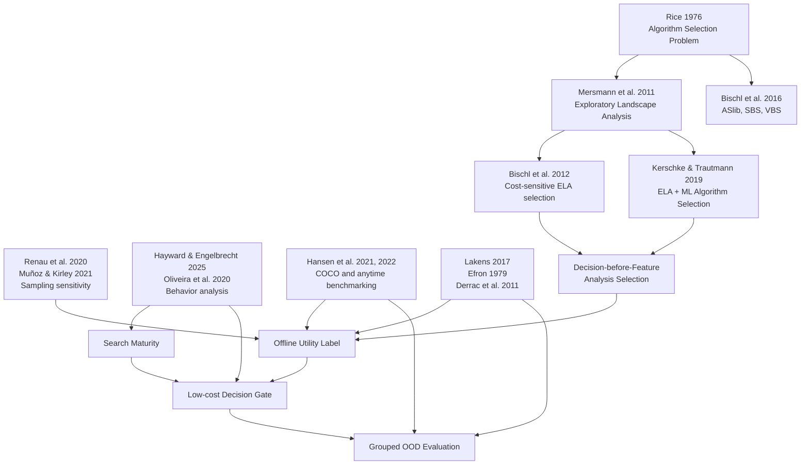

# Decision-before-Feature 科学结论、数学公式与引用关系

## 0. 文档用途

本文档整理当前对话所形成的 Decision-before-Feature 系列研究文档中的主要科学结论、数学公式及其参考文献关系，重点区分：

1. 哪些内容已有文献直接支持；
2. 哪些内容只有方法学或思想来源；
3. 哪些公式是本项目提出的操作性定义；
4. 哪些内容仍是必须通过实验检验的研究假设；
5. 每篇参考文献适合放在论文的什么位置。

引用不是给每句话挂一串作者姓名。真正要避免的是两种情况：把项目自己的创新伪装成前人结论，以及拿一篇“沾边”的论文替尚未完成的实验作证。

---

## 1. 证据等级

| 标记                          | 含义                                           | 推荐写法                     |
| ----------------------------- | ---------------------------------------------- | ---------------------------- |
| **D：直接支持**         | 文献明确提出、定义或验证了该概念               | “已有研究表明……”         |
| **M：方法学支持**       | 文献支持统计方法、实验原则、工具或评价协议     | “依据……本文采用……”     |
| **I：思想来源**         | 文献提供研究灵感，但本项目进行了重新定义或扩展 | “受……启发，本文提出……” |
| **O：项目原创或待验证** | 当前没有文献直接提出同一公式或结论             | “本文定义/提出/假设……”   |

以下内容应明确标为 **O**，不能写成已有文献已经证明：

- Analysis Selection Problem；
- Decision-before-Feature 框架；
- ELA Utility 的具体定义；
- 共享前缀配对续跑离线效用标签；
- Search Maturity；
- $M_t=ES_t(1-XS_t)$；
- “多数早期状态不需要 ELA”；
- “Decision Model 开销可以忽略”；
- “Behavior-only 可以预测 ELA Utility”；
- “BBOB 上训练的模型可以泛化到 CEC”。

---

## 2. 总体引用关系



左侧文献提供背景、方法和实验规范；右侧的 Analysis Selection、ELA Utility、Search Maturity 和 Decision Gate 是本项目要建立的新层次。

---

# 3. 科学结论与引用关系矩阵

## 3.1 Algorithm Selection、ELA 与研究定位

| 编号 | 当前方案中的结论                                              | 证据等级 | 推荐引用               | 引用关系与限制                                                                 |
| ---- | ------------------------------------------------------------- | -------: | ---------------------- | ------------------------------------------------------------------------------ |
| C1   | 不同问题实例可能适合不同算法，因此需要按实例选择算法          |        D | [R1], [R4], [R5]       | Rice 给出经典 Algorithm Selection Problem；ASlib 和 ELA-based AAS 给出标准场景 |
| C2   | ELA 通过数值特征描述连续黑盒问题，并可支持算法选择            |        D | [R2], [R5], [R6], [R7] | 可直接用于定义 ELA 及其用途                                                    |
| C3   | 典型 ELA-based AAS 流程为“特征提取 → 选择器 → 优化算法”   |        D | [R3], [R5]             | 支持基本流程，但不代表所有方法都必须如此                                       |
| C4   | 特征获取成本和算法运行成本可以纳入成本敏感选择                |    D / I | [R3]                   | Bischl 等支持成本敏感选择；本项目进一步决定“是否获取特征”                    |
| C5   | 应先判断 ELA 是否值得执行，再决定是否进入 ELA-based selection |        O | [R1]–[R5] 仅作背景    | 这是本文提出的 Analysis Selection Problem                                      |
| C6   | ELA 的有效成本取决于采样、特征组、实现方式以及样本能否复用    |    D / M | [R5], [R8], [R9]       | 不能无条件写成“ELA 天然昂贵”                                                 |

### 推荐论文表述

> Exploratory landscape analysis provides numerical descriptors of continuous black-box problems and has been combined with machine learning for per-instance algorithm selection [R2, R3, R5]. Existing pipelines, however, generally presume that landscape information is acquired before selection. We introduce a preceding analysis-selection problem that asks whether its expected downstream benefit justifies its acquisition cost.

最后一句属于本文贡献，不应在句末挂一串文献假装前人已经替你创新完了。

---

## 3.2 ELA Utility 与 Offline Utility Label

| 编号 | 当前结论或公式                                            | 证据等级 | 推荐引用           | 引用关系与限制                                                             |
| ---- | --------------------------------------------------------- | -------: | ------------------ | -------------------------------------------------------------------------- |
| C7   | ELA 价值应通过执行与跳过两条路径的结果差异评估            |    O / I | [R3], [R10], [R11] | 成本敏感选择和黑盒基准评估提供基础；两分支定义属于本项目                   |
| C8   | 两条路径应共享相同前缀状态并采用配对随机流                |    M / O | [R29]              | Common Random Numbers 支持配对比较和方差降低；semantic RNG fork 是项目协议 |
| C9   | 所有策略应共享相同总函数评价预算                          |    D / M | [R10], [R11]       | COCO 将函数评价数作为核心黑盒成本                                          |
| C10  | $U_{\mathrm{ELA}}$ 应保存为连续标签，而不只保存二元标签 |        O | [R3] 仅作背景      | 连续效用是本文建模选择                                                     |
| C11  | ELA 路径应使用现实可部署的 selector；VBS 只能作为理论上界 |    D / M | [R1], [R4], [R5]   | SBS/VBS 是算法选择中的标准比较概念                                         |
| C12  | ELA 特征会受采样策略与样本规模影响                        |        D | [R8], [R9]         | 直接支持冻结采样协议和开展敏感性分析                                       |

---

## 3.3 行为特征与 Search Maturity

| 编号 | 当前结论或公式                                           | 证据等级 | 推荐引用              | 引用关系与限制                                         |
| ---- | -------------------------------------------------------- | -------: | --------------------- | ------------------------------------------------------ |
| C13  | 元启发式搜索行为可以通过一组指标进行量化和比较           |        D | [R12], [R13]          | 支持行为分析的可行性                                   |
| C14  | 输入应尽量采用算法无关行为，而不是算法专属参数           |    I / O | [R12], [R13]          | 文献提供跨算法行为表征动机；严格排除算法参数是本文协议 |
| C15  | 改进率、多样性、停滞和方向熵可描述不同搜索状态           |    I / O | [R12], [R14], [R15]   | 各指标有基础，但能否预测 ELA Utility 尚待验证          |
| C16  | Search Maturity 是连接行为与 ELA Utility 的中间状态      |        O | [R12]–[R15] 仅作灵感 | 尚无文献定义同一概念                                   |
| C17  | $M_t=ES_t(1-XS_t)$ 可以刻画搜索成熟度                  |        O | 无直接支持            | 必须通过消融和 OOD 实验验证                            |
| C18  | ELA Utility 与 Search Maturity 可能呈非单调或倒 U 型关系 |        O | 无直接支持            | 属于研究假设，不是已知事实                             |

---

## 3.4 “不需要 ELA”与统计推断

| 编号 | 当前结论或公式                                                 | 证据等级 | 推荐引用     | 引用关系与限制                                 |
| ---- | -------------------------------------------------------------- | -------: | ------------ | ---------------------------------------------- |
| C19  | $p>0.05$ 不能证明两种策略等价                                |        D | [R16]        | 应采用等价性检验或置信区间                     |
| C20  | 等价边界或最小实际效应阈值应预先确定                           |    D / M | [R16]        | 具体$\delta$ 必须由本研究冻结                |
| C21  | Bootstrap 可估计 Utility 或比例的不确定性                      |    D / M | [R17]        | 分层重采样单位由数据依赖结构决定               |
| C22  | 多算法、多问题比较应考虑非参数检验和多重比较校正               |    D / M | [R18], [R19] | 具体检验必须匹配配对层级                       |
| C23  | “多数状态不需要 ELA”可用比例置信下界大于$0.5$ 作为证据规则 |    O / M | [R17]        | 区间估计有文献基础；判据是本文预设规则         |
| C24  | 同一轨迹上的多个 checkpoint 不能视为完全独立样本               |        M | [R17]        | 应以轨迹、种子、函数实例或函数族作为重采样层级 |

---

## 3.5 Decision Model 与资源开销

| 编号 | 当前结论                                            |       证据等级 | 推荐引用                    | 引用关系与限制                                  |
| ---- | --------------------------------------------------- | -------------: | --------------------------- | ----------------------------------------------- |
| C25  | RF、XGBoost、LightGBM 可作为表格型控制器候选        |          D / M | [R20], [R21], [R22]         | 文献支持模型本身，不证明它们在本任务上最佳      |
| C26  | SHAP 可解释模型预测贡献                             |              D | [R23]                       | SHAP 不是因果分析，也不能单独证明特征“不需要” |
| C27  | Decision Model 开销远小于 ELA                       |              O | 无外部文献可替代            | 必须实际测量时间、内存和 FE                     |
| C28  | 若行为特征只读取已有轨迹，则决策阶段可做到零额外 FE | O / 条件性结论 | [R10], [R11] 仅支持 FE 记账 | 只有实现确实不调用目标函数时才成立              |
| C29  | Offline 训练成本与 Online 决策成本应分开报告        |          M / O | [R4], [R10]                 | 具体成本边界由本文定义                          |
| C30  | 更复杂模型是否值得，应通过性能—成本消融判断        |              O | [R20]–[R23] 仅作模型来源   | 不能预设树模型一定足够或神经模型一定过重        |

---

## 3.6 Baseline、Portfolio 与泛化

| 编号 | 当前结论                                                             | 证据等级 | 推荐引用         | 引用关系与限制                                      |
| ---- | -------------------------------------------------------------------- | -------: | ---------------- | --------------------------------------------------- |
| C31  | 应报告 SBS、VBS、现实 selector 和 proposed gate                      |    D / M | [R1], [R4], [R5] | 支持算法选择上下界比较                              |
| C32  | Portfolio 应包含具有互补性的算法                                     |    D / I | [R1], [R5]       | 具体四算法组合仍是本文设计                          |
| C33  | DE、PSO、CMA-ES、SHADE/L-SHADE 可作为代表性连续优化器                |        D | [R24]–[R28]     | 不能仅凭引用宣称已覆盖全部搜索范式                  |
| C34  | BBOB/COCO 可用于规范化黑盒优化评估                                   |        D | [R10], [R11]     | 支持实例、FE 和 anytime 评价                        |
| C35  | CEC2017 与 CEC2022 可作为跨 benchmark 测试集                         |    D / O | [R30], [R31]     | 技术报告定义 benchmark；将其视作 OOD 是本文实验设计 |
| C36  | Function-family grouped split 比随机 instance split 更能检验结构泛化 |    I / O | [R8]–[R10]      | 尚无文献直接规定本项目的具体划分                    |
| C37  | 应分别报告跨维度、跨函数族、跨 benchmark 与留一算法泛化              |    O / M | [R10], [R11]     | 属于本文多层 OOD 协议                               |

---

# 4. 数学公式与引用核对

## 4.1 传统 Algorithm Selection

给定问题实例 $p$、实例特征 $\phi(p)$、算法集合 $\mathcal A$ 和选择器 $S$：

$$
a^*=S\bigl(\phi(p)\bigr),\qquad a^*\in\mathcal A.
$$

引用关系：

- Algorithm Selection Problem：[R1]；
- ELA 特征 $\phi(p)$：[R2]；
- ELA 与机器学习选择器：[R3], [R5]；
- SBS、VBS 和标准化场景：[R4]。

---

## 4.2 Analysis Selection 决策变量

在搜索状态 $s_t$ 上定义：

$$
d_t\in\{0,1\},
$$

其中：

$$
d_t=
\begin{cases}
1, & \text{执行 ELA},\\
0, & \text{跳过 ELA}.
\end{cases}
$$

这是本项目的原创问题定义。可以引用 [R1]–[R5] 说明传统研究聚焦“选择哪个算法”，但公式本身应使用：

> We define an analysis-selection variable...

而不能写成“according to Bischl et al.”，因为他们没有定义这个变量。

---

## 4.3 共享前缀下的 ELA 性能增益

若损失指标 $L$ 越小越好，则：

$$
G_i=L_{\mathrm{skip},i}-L_{\mathrm{ELA},i}.
$$

因此：

$$
G_i>0
$$

表示执行 ELA 后取得了更小损失。

引用关系：

- 差值本身：本文操作性定义；
- 相同总 FE 和黑盒评估：[R10], [R11]；
- 配对随机数与方差降低：[R29]；
- ELA-based selector：[R3], [R5]。

Common Random Numbers 并不自动保证方差下降。其效果依赖两条路径输出的相关性，因此应保存共享前缀，并对不同随机流实现做稳健性检查。

---

## 4.4 ELA 净效用

若两条路径共享相同总 FE，ELA 消耗的函数评价已经通过“剩余优化预算减少”体现，则建议定义：

$$
U_{\mathrm{ELA},i}
=
G_i
-\lambda_T C_{T,i}
-\lambda_M C_{M,i}.
$$

若协议允许 ELA 使用额外函数评价，则可写为：

$$
U_{\mathrm{ELA},i}
=
G_i
-\lambda_{\mathrm{FE}}C_{\mathrm{FE},i}
-\lambda_T C_{T,i}
-\lambda_M C_{M,i}.
$$

其中：

- $C_{\mathrm{FE},i}$：额外函数评价成本；
- $C_{T,i}$：额外时间成本；
- $C_{M,i}$：额外内存或资源成本。

引用关系：

- 成本敏感选择思想：[R3]；
- ELA-based AAS：[R5]；
- FE 与 anytime 评价：[R10], [R11]；
- 具体公式：本文定义。

### 双重计费警告

若 $FE_{\mathrm{ELA}}$ 已从后续优化预算中扣除，就不能在 Utility 中再次扣除同一笔 FE。科研成本账本虽然不归税务局管，也不应一笔钱收两遍。

---

## 4.5 决策阈值

$$
d_i=
\mathbb I\left(
\widehat U_{\mathrm{ELA},i}>\delta
\right),
$$

其中 $\delta$ 是预先冻结的最小实际收益阈值。

- $\delta=0$：只要求正净收益；
- $\delta>0$：只有超过最小实际意义的收益才执行 ELA。

预设最小效应和等价边界的方法依据：[R16]。具体 $\delta$ 是本文协议，不能看完测试结果再挑。

---

## 4.6 多次配对续跑与 Bootstrap

对状态 $i$ 进行 $R$ 次配对续跑：

$$
\widehat U_i
=
\operatorname{median}_{r=1,\ldots,R}
U_i^{(r)}.
$$

通过以函数实例、种子或轨迹为重采样单位的 bootstrap 获得：

$$
[LCB_i,UCB_i].
$$

Bootstrap 方法依据：[R17]。使用中位数以及具体层级结构是本文的稳健聚合方案。

---

## 4.7 Needed、Not-needed 与 Uncertain

$$
y_i=
\begin{cases}
\mathrm{needed}, & LCB_i>\delta,\\[4pt]
\mathrm{not\text{-}needed}, & UCB_i\le\delta,\\[4pt]
\mathrm{uncertain}, & \text{其他情况}.
\end{cases}
$$

引用关系：

- 三分类规则：本文设计；
- 等价边界：[R16]；
- 置信区间：[R17]。

TOST 和置信区间判定应预先指定一个作为主分析，另一个作为稳健性验证。不能等结果出来后再挑“比较懂事”的那套检验。

---

## 4.8 “多数状态不需要 ELA”

$$
\pi_{\mathrm{not}}
=
P\left(
U_{\mathrm{ELA}}\le\delta
\right).
$$

若论文使用“多数”一词，可以预注册证据标准：

$$
LCB_{95\%}\left(
\pi_{\mathrm{not}}
\right)>0.5.
$$

该下界标准是本文定义；置信区间方法依据 [R17]。

建议同时报告：

- checkpoint-level micro-average；
- function-family-balanced macro-average；
- 每个函数族的比例；
- 每个早期 checkpoint 的比例。

---

## 4.9 搜索状态

$$
s_t=
\left[
B_t,\,
P_t
\right],
$$

其中：

- $B_t$：算法无关行为特征；
- $P_t$：预算进度和历史上下文。

行为表征的思想来源：[R12], [R13]；具体状态向量属于本文设计。

---

## 4.10 FE 进度

$$
r_t=
\frac{FE_t}{FE_{\max}}.
$$

COCO/BBOB 将函数评价次数视作核心运行成本和评价尺度：[R10], [R11]。将其归一化为 $r_t$ 是本文为跨预算建模采用的无量纲表示。

---

## 4.11 改进率

对最小化问题，可定义窗口 $k$ 内改进率：

$$
IR_t=
\frac{
f_{\mathrm{best}}(t-k)-f_{\mathrm{best}}(t)
}{k}.
$$

若目标值尺度差异较大，建议使用相对形式：

$$
IR_t^{\mathrm{rel}}
=
\frac{
f_{\mathrm{best}}(t-k)-f_{\mathrm{best}}(t)
}{
\left|f_{\mathrm{best}}(t-k)\right|+\varepsilon
}.
$$

改进历史作为行为指标的思想可引用 [R12]；窗口和归一化形式是本文实现选择。

---

## 4.12 种群多样性

先按变量边界归一化：

$$
\widetilde x_{i,j}
=
\frac{x_{i,j}-l_j}{u_j-l_j}.
$$

再定义平均两两距离：

$$
D_t=
\frac{2}{N_t(N_t-1)}
\sum_{1\le i<j\le N_t}
\left\|
\widetilde x_i-\widetilde x_j
\right\|_2.
$$

多样性变化：

$$
\Delta D_t=D_t-D_{t-k}.
$$

多样性及其变化用于行为分析可引用 [R12], [R14]。具体距离与归一化方式是本文定义。

需要检查：

- 维度效应；
- 种群规模效应；
- L-SHADE 人口递减效应；
- 边界范围不一致的影响。

---

## 4.13 方向熵

将位移方向划分为 $B$ 个箱，记频率为 $p_b$：

$$
H_t
=
-\frac{1}{\log B}
\sum_{b=1}^{B}
p_b\log p_b.
$$

- 熵的数学基础：[R15]；
- 将熵用于搜索位移方向：本文行为特征设计；
- 行为分析动机：[R12]。

必须写清：

- 位移向量如何归一化；
- 零位移如何处理；
- 高维方向如何离散；
- $B$ 如何确定；
- 稀疏频数如何平滑。

---

## 4.14 停滞程度

一种无量纲定义为：

$$
S_t=
\min\left(
1,\,
\frac{\text{连续无改善 FE 数}}{W}
\right),
$$

其中 $W$ 是预先冻结的窗口。停滞作为行为信息可引用 [R12]；公式属于本文设计。

---

## 4.15 Search Maturity

当前方案定义：

$$
M_t=ES_t(1-XS_t),
$$

其中：

- $ES_t$：Exploration Stabilization；
- $XS_t$：Exploitation Saturation。

这是本文提出的启发式潜变量。行为文献 [R12]–[R15] 只能支持输入指标有行为意义，不能直接支持乘积公式。

必须验证：

1. 相比只用 $ES_t$ 或 $XS_t$ 是否更好；
2. 是否优于加权和、比值或学习型潜变量；
3. 是否只是 FE ratio 的替代品；
4. 是否跨算法、跨维度和跨函数族稳定；
5. 与 $U_{\mathrm{ELA}}$ 是否确实存在非单调关系。

推荐写法：

> We introduce a heuristic search-maturity score...

不应写成：

> Search maturity is defined in the literature as...

---

## 4.16 Utility 预测模型

$$
\widehat U_{\mathrm{ELA},i}
=
f_\theta(s_i).
$$

加权回归可写为：

$$
\min_\theta
\sum_{i=1}^{n}
w_i\,
\ell\left(
f_\theta(s_i),
U_{\mathrm{ELA},i}
\right),
$$

其中 $w_i$ 可由 Utility 置信区间宽度或标签稳定性决定。

模型引用：

- Random Forest：[R20]；
- XGBoost：[R21]；
- LightGBM：[R22]；
- SHAP：[R23]。

具体损失函数、样本权重和最终模型选择属于本文方法。

---

## 4.17 Decision 开销

端到端成本账本建议写为：

$$
C_{\mathrm{DBF}}
=
C_{\mathrm{probe}}
+C_{\mathrm{behavior}}
+C_{\mathrm{model}}
+\mathbb I(d=1)C_{\mathrm{ELA}}
+C_{\mathrm{selection}}
+C_{\mathrm{optimization}}.
$$

Decision gate 本身：

$$
C_{\mathrm{gate}}
=
C_{\mathrm{behavior}}
+C_{\mathrm{model}}.
$$

开销比例：

$$
\rho_{\mathrm{gate}}
=
\frac{C_{\mathrm{gate}}}{C_{\mathrm{ELA}}}.
$$

成本意识背景：[R3]；FE 与 wall-time 评价：[R10], [R11]。具体公式是本文记账定义。

$$
\rho_{\mathrm{gate}}\ll1
$$

是需要实验检验的假设，不是因为模型叫“Random Forest”就自动成立。处理器并不接受文学论证。

---

## 4.18 等总 FE 预算

$$
FE_{\mathrm{total}}
=
FE_{\mathrm{prefix}}
+FE_{\mathrm{analysis}}
+FE_{\mathrm{optimization}}.
$$

跳过 ELA：

$$
FE_{\mathrm{analysis}}=0.
$$

执行 ELA：

$$
FE_{\mathrm{optimization}}
=
FE_{\mathrm{total}}
-FE_{\mathrm{prefix}}
-FE_{\mathrm{analysis}}.
$$

黑盒函数评价成本的依据：[R10], [R11]；具体预算恒等式是本文协议。

---

## 4.19 Compact ELA

成本感知的紧凑特征集可定义为：

$$
\mathcal F^*
=
\arg\min_{\mathcal S\subseteq\mathcal F}
C(\mathcal S)
$$

满足：

$$
Q(\mathcal S)
\ge
Q(\mathcal F)-\epsilon.
$$

引用关系：

- ELA 工具与特征集合：[R6], [R7]；
- 采样与稳定性：[R8], [R9]；
- 约束形式：本文扩展。

只有在训练集选择 $\mathcal F^*$、冻结后在未见函数族或跨 benchmark 测试，并通过等价性分析，才能写“对当前决策任务，完整 ELA 特征集存在冗余”。

---

# 5. 论文各章节的引用配置

## 5.1 Introduction

建议引用：

- Algorithm Selection：[R1], [R4]；
- ELA：[R2]；
- ELA-based AAS：[R3], [R5]；
- 采样敏感性：[R8], [R9]。

不要在引言中提前宣称：

- 大多数 ELA 调用无效；
- gate 开销可以忽略；
- Search Maturity 与 Utility 呈倒 U 型；
- BBOB 训练必然能泛化到 CEC。

这些应写成研究问题。

---

## 5.2 Related Work

建议分为：

1. Automated Algorithm Selection：[R1], [R4]；
2. Exploratory Landscape Analysis for AAS：[R2], [R3], [R5]–[R9]；
3. Behavior-based Metaheuristic Analysis：[R12]–[R15]；
4. Cost-aware and Resource-aware Evaluation：[R3], [R10], [R11]。

---

## 5.3 Problem Formulation

引用背景后使用原创措辞：

> We define...

适用于：

- Analysis Selection Problem；
- $d_t$；
- $G_i$；
- $U_{\mathrm{ELA},i}$；
- $\delta$；
- shared-prefix oracle。

段首可引用 [R1], [R3], [R5]，FE 记账引用 [R10], [R11]。公式后可以明确写 `defined in this work`。

---

## 5.4 Behavior Representation

- 行为分析动机：[R12], [R13]；
- 多样性变化：[R14]；
- 熵基础：[R15]；
- Search Maturity 标明为本文提出。

---

## 5.5 Statistical Analysis

- Bootstrap：[R17]；
- TOST 与最小实际效应：[R16]；
- 非参数算法比较：[R18]；
- Holm 校正：[R19]；
- Common Random Numbers：[R29]。

---

## 5.6 Experimental Setup

- COCO/BBOB：[R10], [R11]；
- CEC2017：[R30]；
- CEC2022：[R31]；
- DE、PSO、CMA-ES、SHADE/L-SHADE：[R24]–[R28]；
- ELA 实现：[R6], [R7]。

---

## 5.7 Explainability and Overhead

- RF/XGBoost/LightGBM：[R20]–[R22]；
- SHAP：[R23]；
- 成本敏感背景：[R3]；
- 实际 gate 开销必须引用本文实验表，而非模型原始论文。

---

# 6. 当前内部文档与外部文献的对应关系

| 当前文档                                                                 | 主要参考文献                           | 仍属于项目原创或待验证的部分                   |
| ------------------------------------------------------------------------ | -------------------------------------- | ---------------------------------------------- |
| `Decision-before-Feature Master Research Specification.md`             | [R1]–[R5], [R10]–[R14]               | 总体框架、Analysis Selection、核心 RQ          |
| `Decision-before-Feature_数学定义与方法章节.md`                        | [R1]–[R5], [R10], [R11]               | $U_{\mathrm{ELA}}$、$d_t$、$M_t$         |
| `docs/10_protocols/Decision-before-Feature_Offline Utility Label构建协议.md` | [R3], [R5], [R8]–[R11], [R29]         | 共享前缀配对续跑、标签聚合                    |
| `Decision-before-Feature_Search Maturity理论设计.md`                   | [R12]–[R15]                           | Search Maturity 和倒 U 假设                    |
| `Decision-before-Feature Behavior Feature Taxonomy与指标选择协议.md`   | [R12]–[R15]                           | 特征集合、窗口和归一化                         |
| `docs/10_protocols/Decision-before-Feature Algorithm Portfolio与Selection Reference设计.md` | [R1], [R4], [R5], [R24]–[R28]         | 四算法组合和现实 selector                      |
| `Decision-before-Feature Baseline与公平比较协议.md`                    | [R4], [R5], [R10], [R11], [R16]–[R19] | Never/Always/Random gate 协议                  |
| `Decision-before-Feature_维度与泛化实验设计.md`                        | [R8]–[R11], [R30], [R31]              | BBOB→CEC 与多层 OOD                           |
| `Decision-before-Feature_特征信息必要性与ELA信息价值验证设计.md`       | [R8], [R9], [R16], [R17]               | “多数不需要”规则、Compact ELA                |
| `Decision-before-Feature_Decision_Model计算成本与资源开销分析设计.md`  | [R3], [R10], [R11], [R20]–[R23]       | $C_{\mathrm{DBF}}$、开销比例、零额外 FE 假设 |
| `AGENTS.md`                                                            | 不需要学术引用                         | 工程和实验隔离规范，不进入论文参考文献         |

---

# 7. 容易产生的错误引用

## 7.1 “ELA 很昂贵”

不严谨：

> ELA is computationally expensive [R5].

ELA 成本取决于：

- 是否额外采样；
- 样本是否复用；
- 特征类别；
- 样本规模；
- 目标函数评价代价；
- 特征计算实现。

推荐：

> The effective cost of ELA is protocol-dependent. Although sampled points can sometimes be reused by the subsequent optimizer [R5], feature estimates remain sensitive to sampling design and sample size [R8, R9]. We therefore account separately for sampling, feature computation, and downstream opportunity costs.

---

## 7.2 “行为特征已经被证明能预测 ELA Utility”

[R12] 等文献支持行为可以被量化，但没有研究 ELA Utility。

推荐：

> Prior work demonstrates that metaheuristic behavior can be quantified using computationally inexpensive descriptors [R12]. We investigate the new hypothesis that these descriptors predict the marginal value of landscape analysis.

---

## 7.3 “Search Maturity 是已有成熟概念”

当前 $M_t=ES_t(1-XS_t)$ 没有直接文献来源，必须写为本文提出。

---

## 7.4 “不显著说明等价”

错误。应引用 [R16]，预设实际等价边界并采用 TOST 或相应置信区间判断。

---

## 7.5 “SHAP 证明特征不需要”

SHAP [R23] 解释的是模型预测贡献，不直接证明：

- 特征没有信息；
- 特征没有因果作用；
- 特征不可替代；
- 获取该特征不值得。

必要性必须通过冻结特征子集后的 OOD 等价性实验建立。

---

## 7.6 “树模型推理开销可以忽略”

[R20]–[R22] 不能替代本项目计时。必须在同一硬件、线程、批量和缓存设置下测量：

- behavior extraction；
- model inference；
- ELA sampling；
- ELA feature computation；
- selector；
- peak RSS；
- wall-time。

---

## 7.7 “CEC 天然就是 OOD”

CEC 技术报告 [R30], [R31] 只定义 benchmark。论文仍需说明：

- 与 BBOB 的结构差异；
- 是否存在函数形式重叠；
- 特征分布差异；
- 行为状态分布差异；
- 为何可视为跨 benchmark 泛化。

---

# 8. 可直接放入论文的引用模板

## 8.1 研究背景

> The algorithm selection problem aims to select, for each problem instance, a solver from a predefined portfolio according to instance characteristics and expected algorithm performance [R1, R4]. In continuous black-box optimization, exploratory landscape analysis provides numerical descriptors that can be combined with machine learning to construct per-instance selectors [R2, R3, R5].

## 8.2 研究缺口

> Existing ELA-based selection pipelines primarily focus on which optimizer should be selected after landscape information has been acquired [R3, R5]. The preceding question of whether the expected benefit of acquiring this information justifies its cost has received substantially less attention. We formulate this question as the analysis selection problem.

第二句属于研究缺口判断，第三句属于本文贡献。

## 8.3 采样与成本

> ELA feature values depend on the sampling strategy and sample size used for their approximation [R8, R9]. Moreover, the practical cost of ELA depends on whether sampled points can be reused by the subsequent optimization process [R5]. We therefore maintain separate accounting for objective evaluations, feature-computation time, model inference, memory, and wall-clock time.

## 8.4 行为特征

> Previous work has shown that search behavior can be characterized through computationally inexpensive behavioral descriptors and compared across metaheuristics [R12, R13]. Based on this observation, we test whether progress, diversity, directional entropy, and stagnation observed from optimization trajectories contain predictive information about the marginal utility of ELA.

## 8.5 等价性分析

> A nonsignificant difference does not establish practical equivalence. We therefore prespecify a smallest effect of interest and use equivalence-oriented confidence-interval and TOST analyses [R16], with bootstrap uncertainty estimates [R17].

## 8.6 Benchmark 与预算

> We follow COCO principles by treating the number of objective evaluations as a central black-box cost and by reporting performance over the available evaluation budget [R10, R11]. All compared policies share the same total evaluation budget, so evaluations consumed by analysis reduce the budget available for subsequent optimization.

## 8.7 决策开销

> Because model complexity does not itself imply negligible deployment cost, we measure behavior extraction and model inference separately from ELA sampling and feature computation. The proposed gate is considered resource-efficient only if its measured overhead remains small relative to the analysis cost it avoids.

最后一段主要由本文实验支持，不应让 RF 或 XGBoost 原始论文替它担保。

---

# 9. 参考文献

## Algorithm Selection 与 ELA

**[R1]** Rice, J. R. (1976). The Algorithm Selection Problem. *Advances in Computers*, 15, 65–118. DOI: [https://doi.org/10.1016/S0065-2458(08)60520-3](https://doi.org/10.1016/S0065-2458(08)60520-3).

**[R2]** Mersmann, O., Bischl, B., Trautmann, H., Preuss, M., Weihs, C., & Rudolph, G. (2011). Exploratory Landscape Analysis. In *Proceedings of GECCO 2011* (pp. 829–836). DOI: [https://doi.org/10.1145/2001576.2001690](https://doi.org/10.1145/2001576.2001690).

**[R3]** Bischl, B., Mersmann, O., Trautmann, H., & Preuss, M. (2012). Algorithm Selection Based on Exploratory Landscape Analysis and Cost-Sensitive Learning. In *Proceedings of GECCO 2012* (pp. 313–320). DOI: [https://doi.org/10.1145/2330163.2330209](https://doi.org/10.1145/2330163.2330209).

**[R4]** Bischl, B., Kerschke, P., Kotthoff, L., Lindauer, M., Malitsky, Y., Fréchette, A., Hoos, H. H., Hutter, F., Leyton-Brown, K., Tierney, K., & Vanschoren, J. (2016). ASlib: A Benchmark Library for Algorithm Selection. *Artificial Intelligence*, 237, 41–58. DOI: [https://doi.org/10.1016/j.artint.2016.04.003](https://doi.org/10.1016/j.artint.2016.04.003).

**[R5]** Kerschke, P., & Trautmann, H. (2019). Automated Algorithm Selection on Continuous Black-Box Problems by Combining Exploratory Landscape Analysis and Machine Learning. *Evolutionary Computation*, 27(1), 99–127. DOI: [https://doi.org/10.1162/evco_a_00236](https://doi.org/10.1162/evco_a_00236).

**[R6]** Kerschke, P., & Trautmann, H. (2016). The R-Package FLACCO for Exploratory Landscape Analysis with Applications to Multi-Objective Optimization Problems. In *2016 IEEE Congress on Evolutionary Computation* (pp. 5262–5269). DOI: [https://doi.org/10.1109/CEC.2016.7748359](https://doi.org/10.1109/CEC.2016.7748359).

**[R7]** Prager, R. P., & Trautmann, H. (2024). Pflacco: Feature-Based Landscape Analysis of Continuous and Constrained Optimization Problems in Python. *Evolutionary Computation*, 32(3), 211–216. DOI: [https://doi.org/10.1162/evco_a_00341](https://doi.org/10.1162/evco_a_00341).

**[R8]** Renau, Q., Doerr, C., Dréo, J., & Doerr, B. (2020). Exploratory Landscape Analysis Is Strongly Sensitive to the Sampling Strategy. In *Parallel Problem Solving from Nature – PPSN XVI* (pp. 139–153). DOI: [https://doi.org/10.1007/978-3-030-58115-2_10](https://doi.org/10.1007/978-3-030-58115-2_10).

**[R9]** Muñoz, M. A., & Kirley, M. (2021). Sampling Effects on Algorithm Selection for Continuous Black-Box Optimization. *Algorithms*, 14(1), 19. DOI: [https://doi.org/10.3390/a14010019](https://doi.org/10.3390/a14010019).

## Benchmarking 与行为分析

**[R10]** Hansen, N., Auger, A., Ros, R., Mersmann, O., Tušar, T., & Brockhoff, D. (2021). COCO: A Platform for Comparing Continuous Optimizers in a Black-Box Setting. *Optimization Methods and Software*, 36(1), 114–144. DOI: [https://doi.org/10.1080/10556788.2020.1808977](https://doi.org/10.1080/10556788.2020.1808977).

**[R11]** Hansen, N., Auger, A., Brockhoff, D., & Tušar, T. (2022). Anytime Performance Assessment in Blackbox Optimization Benchmarking. *IEEE Transactions on Evolutionary Computation*, 26(6), 1293–1305. DOI: [https://doi.org/10.1109/TEVC.2022.3210897](https://doi.org/10.1109/TEVC.2022.3210897).

**[R12]** Hayward, L., & Engelbrecht, A. P. (2025). Determining Metaheuristic Similarity Using Behavioral Analysis. *IEEE Transactions on Evolutionary Computation*, 29(1), 262–274. DOI: [https://doi.org/10.1109/TEVC.2023.3346672](https://doi.org/10.1109/TEVC.2023.3346672).

**[R13]** Oliveira, M., Pinheiro, D., Macedo, M., Bastos-Filho, C., & Menezes, R. (2020). Uncovering the Social Interaction Network in Swarm Intelligence Algorithms. *Applied Network Science*, 5, Article 24. DOI: [https://doi.org/10.1007/s41109-020-00260-8](https://doi.org/10.1007/s41109-020-00260-8).

**[R14]** Bosman, P., & Engelbrecht, A. P. (2014). Diversity Rate of Change Measurement for Particle Swarm Optimisers. In *Swarm Intelligence* (LNCS 8667, pp. 86–97). DOI: [https://doi.org/10.1007/978-3-319-09952-1_8](https://doi.org/10.1007/978-3-319-09952-1_8).

**[R15]** Shannon, C. E. (1948). A Mathematical Theory of Communication. *Bell System Technical Journal*, 27(3), 379–423; 27(4), 623–656. DOI: [https://doi.org/10.1002/j.1538-7305.1948.tb01338.x](https://doi.org/10.1002/j.1538-7305.1948.tb01338.x); [https://doi.org/10.1002/j.1538-7305.1948.tb00917.x](https://doi.org/10.1002/j.1538-7305.1948.tb00917.x).

## 统计推断

**[R16]** Lakens, D. (2017). Equivalence Tests: A Practical Primer for t Tests, Correlations, and Meta-Analyses. *Social Psychological and Personality Science*, 8(4), 355–362. DOI: [https://doi.org/10.1177/1948550617697177](https://doi.org/10.1177/1948550617697177).

**[R17]** Efron, B. (1979). Bootstrap Methods: Another Look at the Jackknife. *The Annals of Statistics*, 7(1), 1–26. DOI: [https://doi.org/10.1214/aos/1176344552](https://doi.org/10.1214/aos/1176344552).

**[R18]** Derrac, J., García, S., Molina, D., & Herrera, F. (2011). A Practical Tutorial on the Use of Nonparametric Statistical Tests as a Methodology for Comparing Evolutionary and Swarm Intelligence Algorithms. *Swarm and Evolutionary Computation*, 1(1), 3–18. DOI: [https://doi.org/10.1016/j.swevo.2011.02.002](https://doi.org/10.1016/j.swevo.2011.02.002).

**[R19]** Holm, S. (1979). A Simple Sequentially Rejective Multiple Test Procedure. *Scandinavian Journal of Statistics*, 6(2), 65–70. Stable record: [https://www.jstor.org/stable/4615733](https://www.jstor.org/stable/4615733).

## 机器学习与解释

**[R20]** Breiman, L. (2001). Random Forests. *Machine Learning*, 45, 5–32. DOI: [https://doi.org/10.1023/A:1010933404324](https://doi.org/10.1023/A:1010933404324).

**[R21]** Chen, T., & Guestrin, C. (2016). XGBoost: A Scalable Tree Boosting System. In *Proceedings of KDD 2016* (pp. 785–794). DOI: [https://doi.org/10.1145/2939672.2939785](https://doi.org/10.1145/2939672.2939785).

**[R22]** Ke, G., Meng, Q., Finley, T., Wang, T., Chen, W., Ma, W., Ye, Q., & Liu, T.-Y. (2017). LightGBM: A Highly Efficient Gradient Boosting Decision Tree. In *Advances in Neural Information Processing Systems 30*.

**[R23]** Lundberg, S. M., & Lee, S.-I. (2017). A Unified Approach to Interpreting Model Predictions. In *Advances in Neural Information Processing Systems 30* (pp. 4765–4774).

## Algorithm Portfolio

**[R24]** Storn, R., & Price, K. (1997). Differential Evolution: A Simple and Efficient Heuristic for Global Optimization over Continuous Spaces. *Journal of Global Optimization*, 11(4), 341–359. DOI: [https://doi.org/10.1023/A:1008202821328](https://doi.org/10.1023/A:1008202821328).

**[R25]** Kennedy, J., & Eberhart, R. (1995). Particle Swarm Optimization. In *Proceedings of ICNN'95* (pp. 1942–1948). DOI: [https://doi.org/10.1109/ICNN.1995.488968](https://doi.org/10.1109/ICNN.1995.488968).

**[R26]** Hansen, N., & Ostermeier, A. (2001). Completely Derandomized Self-Adaptation in Evolution Strategies. *Evolutionary Computation*, 9(2), 159–195. DOI: [https://doi.org/10.1162/106365601750190398](https://doi.org/10.1162/106365601750190398).

**[R27]** Tanabe, R., & Fukunaga, A. (2013). Success-History Based Parameter Adaptation for Differential Evolution. In *2013 IEEE Congress on Evolutionary Computation* (pp. 71–78). DOI: [https://doi.org/10.1109/CEC.2013.6557555](https://doi.org/10.1109/CEC.2013.6557555).

**[R28]** Tanabe, R., & Fukunaga, A. (2014). Improving the Search Performance of SHADE Using Linear Population Size Reduction. In *2014 IEEE Congress on Evolutionary Computation*. DOI: [https://doi.org/10.1109/CEC.2014.6900380](https://doi.org/10.1109/CEC.2014.6900380).

## 配对随机数

**[R29]** Glasserman, P., & Yao, D. D. (1992). Some Guidelines and Guarantees for Common Random Numbers. *Management Science*, 38(6), 884–908. DOI: [https://doi.org/10.1287/mnsc.38.6.884](https://doi.org/10.1287/mnsc.38.6.884).

## 外部测试 Benchmark

**[R30]** Awad, N. H., Ali, M. Z., Suganthan, P. N., Liang, J. J., & Qu, B. Y. (2016). *Problem Definitions and Evaluation Criteria for the CEC 2017 Special Session and Competition on Single Objective Bound Constrained Real-Parameter Numerical Optimization*. Technical Report, Nanyang Technological University.

**[R31]** Kumar, A., Price, K. V., Mohamed, A. W., Hadi, A. A., & Suganthan, P. N. (2021). *Problem Definitions and Evaluation Criteria for the 2022 Special Session and Competition on Single Objective Bound Constrained Numerical Optimization*. Technical Report, Nanyang Technological University.

---

# 10. 建议的文献键

正式进入 Typst、LaTeX 或 Pandoc 引用系统后，建议使用语义化键，而不是手工维护数字：

```text
rice1976algorithm
mersmann2011ela
bischl2012cost
bischl2016aslib
kerschke2019aas
renau2020sampling
munoz2021sampling
hansen2021coco
hansen2022anytime
hayward2025behavior
lakens2017equivalence
efron1979bootstrap
glasserman1992crn
```

数字编号应由文献管理工具自动生成。手工维护几十篇文献编号，是人类为了证明自己仍然能制造低级错误而保留的传统工艺。

---

# 11. 当前最需要实验建立的八个结论

以下结论没有现成文献可以直接担保，必须由本文实验建立：

1. 多数早期搜索状态满足 $U_{\mathrm{ELA}}\le\delta$；
2. Behavior-only 可以预测 ELA Utility；
3. Search Maturity 是稳定且可泛化的中间表征；
4. $M_t=ES_t(1-XS_t)$ 优于直接的 Behavior $\rightarrow$ Utility；
5. Decision gate 的开销相对被避免的 ELA 成本足够小；
6. Compact ELA 在 OOD 条件下与 Full ELA 实际等价；
7. BBOB 上训练的决策模型能够泛化到 CEC2017/CEC2022；
8. 跨算法模型学习的是行为规律，而非算法身份。

这些没有直接文献支持并不是缺点。它们恰恰构成论文的贡献空间，前提是不要在实验完成前把它们写成已经由宇宙认证的事实。
